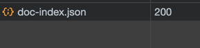
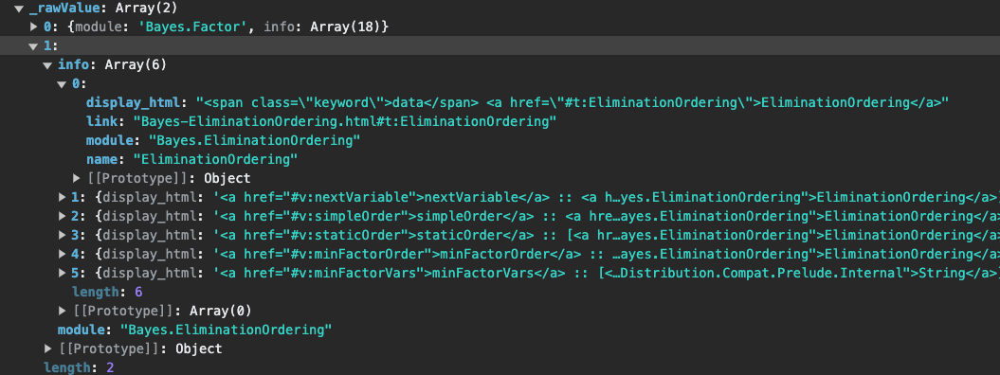

# Daily Log
 this is the supplementary log for daily work.
 
## 1.11.2023
Started to find the correct way to download all the package on the hackage website. During that, I found some api on  https://hackage.haskell.org/api, so i decide to firstly give this api a closer look.

Sadly, this api is very bad documented, no one can gather any useful information with it. The whole structure of the API is not so clear and most importantly, no example request and response is provided. So I had to try this api one by one using postman, but without and clue, the blindly attempts result only a few usable APIs.

Then I browsed the hackage website with my chrome webdev tool open, I checked the network tab and I found it contains some package source info. Then I thought it must be some  api for that.

Below is the responding api for that. I checked the response, it contains basically the information we needed to generate the signature. so I decide to use this method for the first try.

from our last email, at least two way is given for download the package infos
1. web scraper
2. download and build the doc locally
3. using the api

the first and second method still need to cache the scraped info somehow, and provided to some cli program or something else, it need refresh the cache using the ci job or cronjob or whatever and everything. Checking the requirements about be more interactive, I decide to make a webpage using api for it and if you don't like the webpage, I can still make some Cli clients or export the data you need.

I created a project on my github and then do the scaffold for the project, and write all api that I know to the js file.

## 2.11.2023

started to create the search and preview page, found the hackage has cors limitations, solved it by a php proxy, currently installed on a random server. During the first step of digging the api, I found that not all the package has the doc-index.json type document.

That is only for the package that using haddock on higher version, So I add a filter to the search query to filtered all the package that not been updated for more than 5 years

I refactor some code from yesterday and then make the page cleaner.

I tried to build some filters, this is the data that I can catch from the hackdoc json files, not really come out any ideas.

So I just make two filter, one is to filter down that too small modules, I think to use it in the exam means it has to have some complexity.

another one is the to filter all the module that has at least one of type with :: annotation, I believe this is all the function needed in Haskell.

I start to thinking how I should present this webpage to you, so I make it available on Vercel, the link for it is

#

