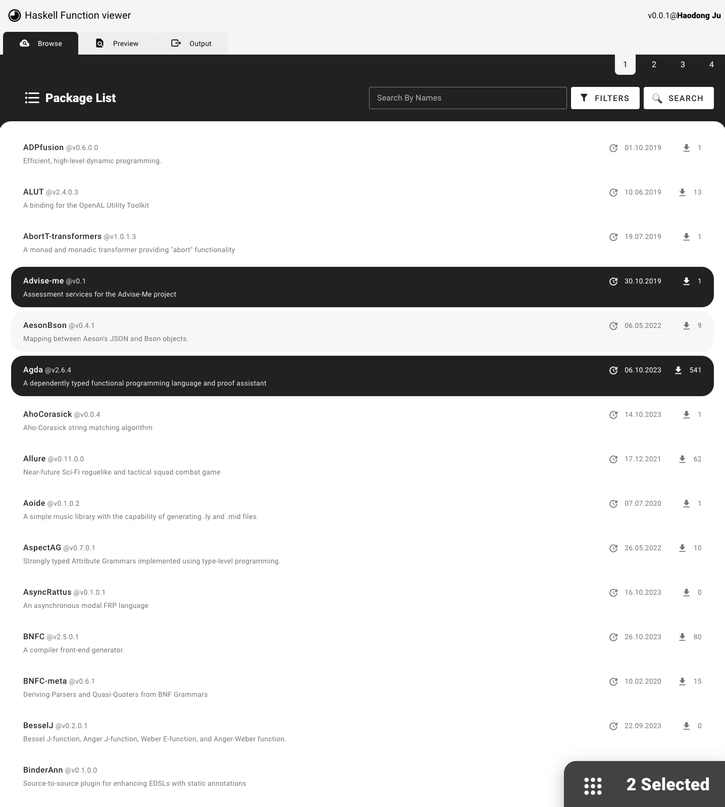
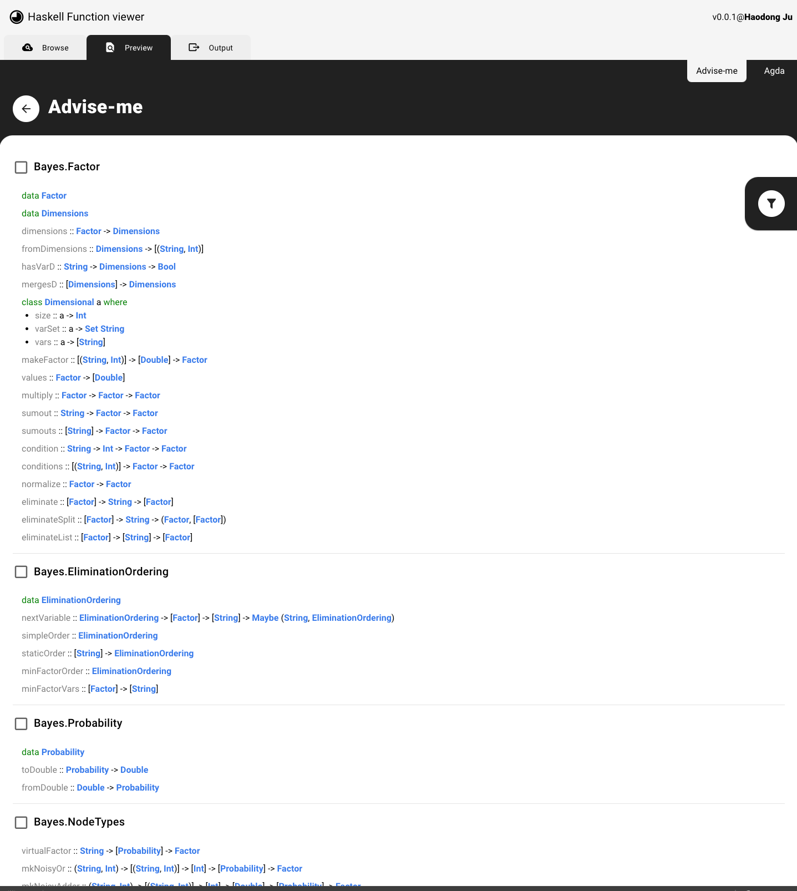
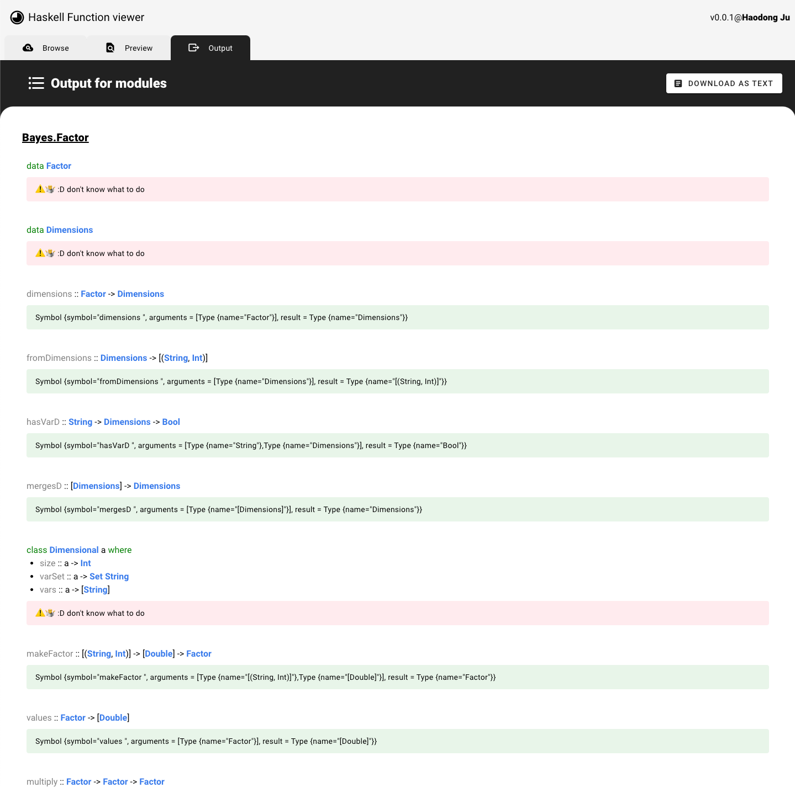

# Important things

### Postman collections
https://api.postman.com/collections/7616131-5c081cdc-50e1-4d8a-8eb7-6bee206f95b8?access_key=PMAT-01HEBB75HMBMCR255T0YYJ0V4X

### Manual for this project
1. browse and select some package, you can use the search and filter functions

2. select modules that you may interest, can filter by size and if it has at least one function.

3. output and download in required format.

